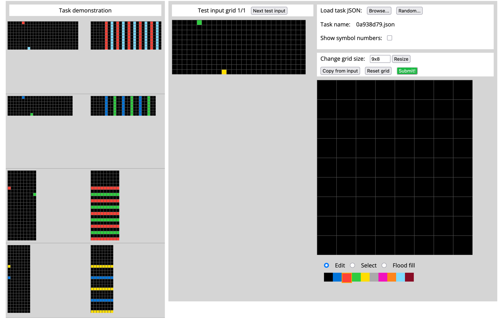

Ok... this looks pretty obvious. The first one red and blue are seeds, and they
fill in.

So, first, the color fills in the line, from side to side like here
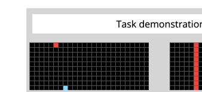

Then the next color is filled in side to side:

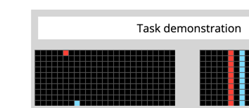

Notice the spacing. The column red is on has a gap of one black between it
and the column the light blue is on.

Then the pattern just repeats left to right:

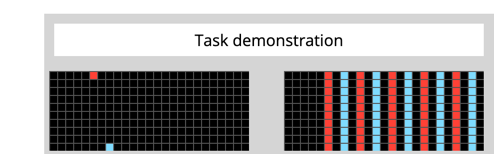

Next one is different, slightly.

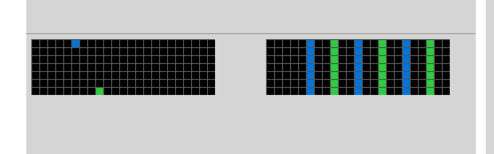

The main thing here is the spacing. This has two empty columns, where the first
had only one.

Third example is pretty clear, it's the same pattern as the first, just rotated 90 degrees.

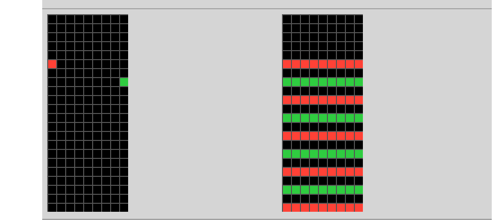

Okay, the fourth is slightly different, but not much:

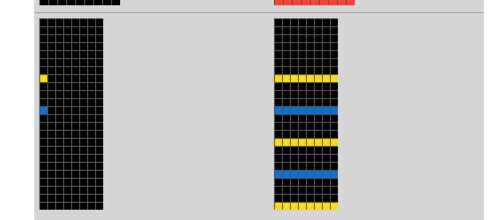

Both seeds start on the left and grow to the right, and the spacing is wider. 

Looks like, the seeds fill in whatever row/column they are on, then the columns get filled in next.

Let's try to solve this.

First, let's copy the input.

The first seed is green. Let's fill it in:

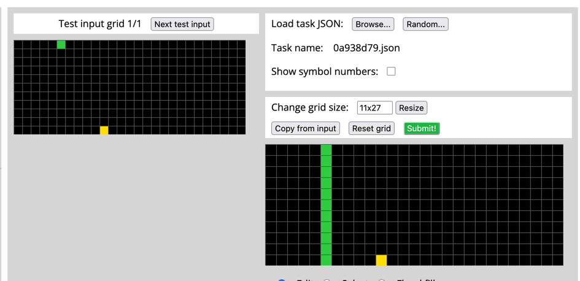

Now on to yellow.

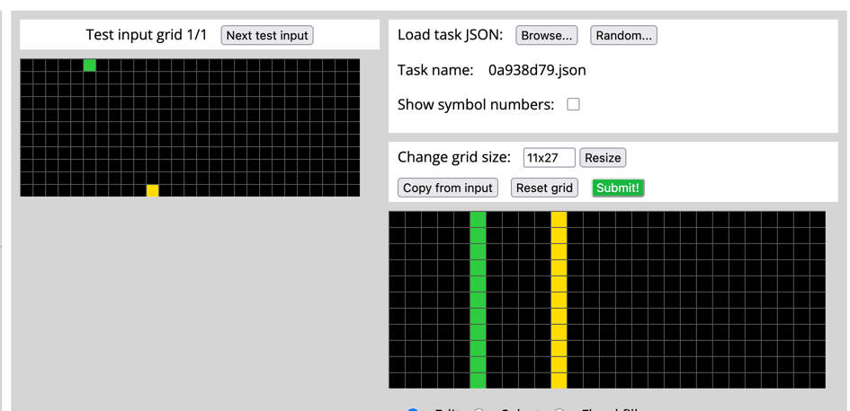

Okay, looks like 4 emtpy columns, lets make the next green column 4 to the right
of yellow.

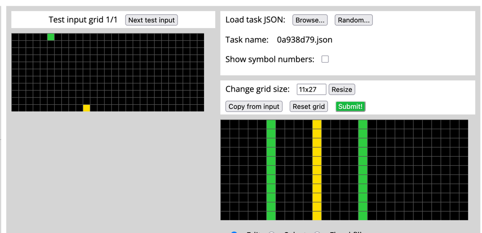

Now another green... I mean yellow. Another yellow.

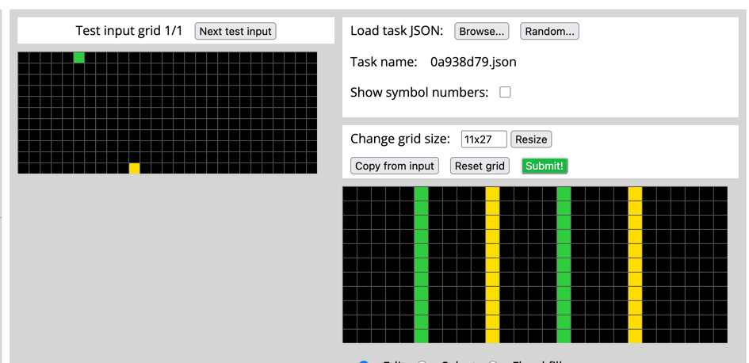

One more green...

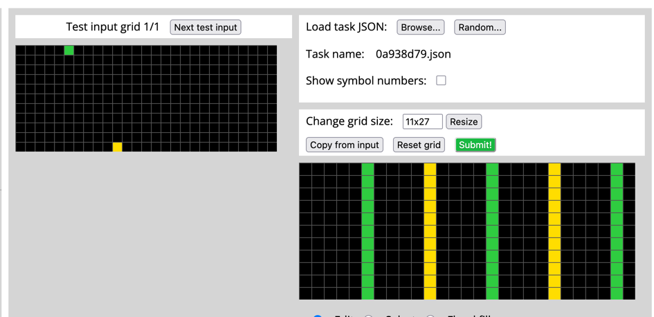

This looks correct. Seeds grew across the rectangle and then the rows filled in left to right.

I'm going to try this submission.

Great! That was correct!