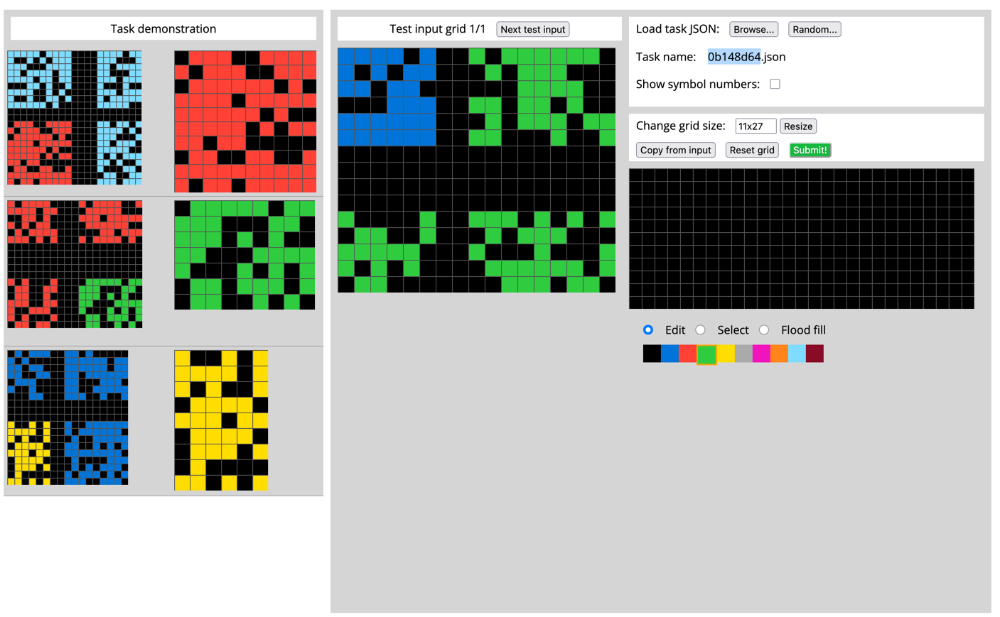
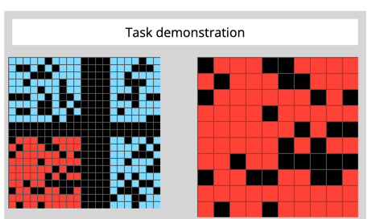
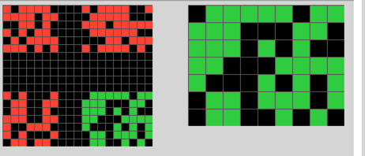
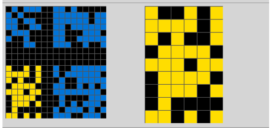
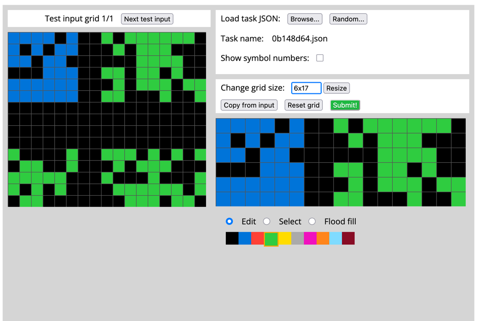
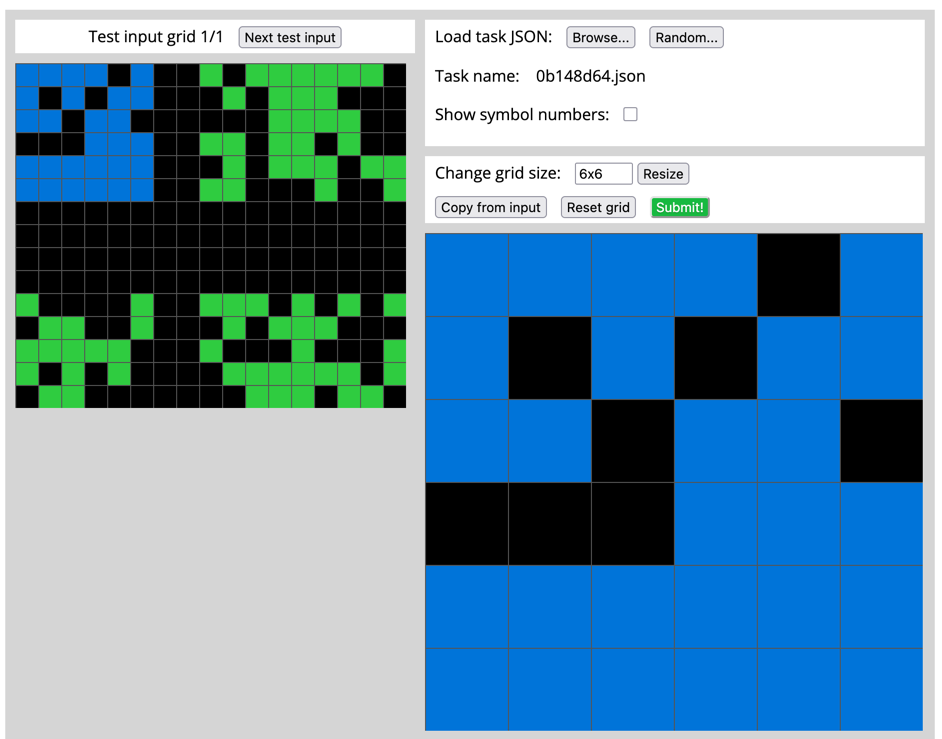

This is ugly...

is it a zoom? Wait... look at the first example.

There's four "quadrants"? Let's call them quadrants. three light blue, one red.
the solution just has the red. Is it only the red? Yeah. It's only the red, and it's unchanged.

So the solution here was to exclude everything that isn't part of the "different"
quadrant.

Let's check that against the next example.

I think we're on to something. Four quadrents, 3 red, one green. In the solution,
we only keep the green. Like we're zooming in on the green. Let's check the next one.

Yeep. I think we nailed this down, input has the same 4 quadrant setup, with one quadrant
that's a different color. The different color makes it into the solution. Let's try solving this.

Definitely need to change the grid size. So, we've got 4 quadrants, 3 green, 1 blue.
Blue's gotta stay.

Let's copy from input

<copy input>

I think we can just slice down the grid here and that should work...

Nice. Wait, now we need it to be 6 x 6, not 6 x 17. Let's resize
<resize, 6x6>

I think this is right. Let's try submitting this.

<submit/>

Great! it's correct!!