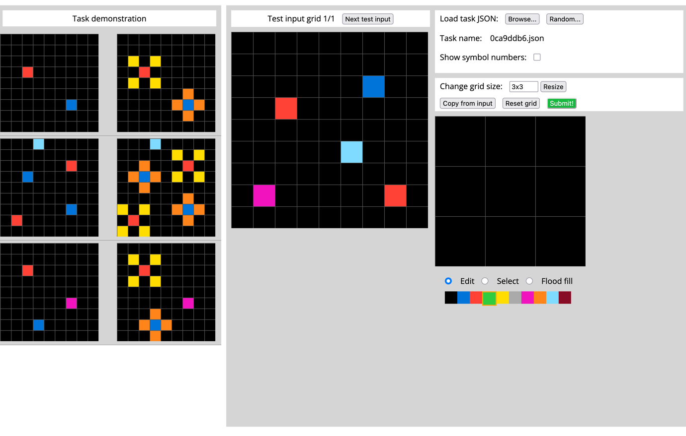
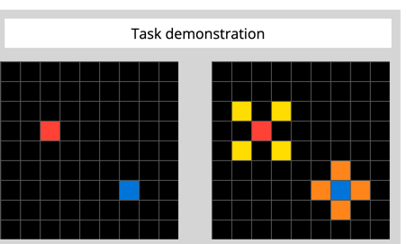
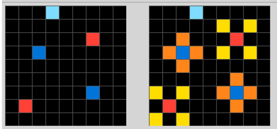
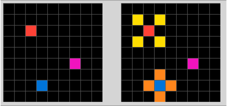
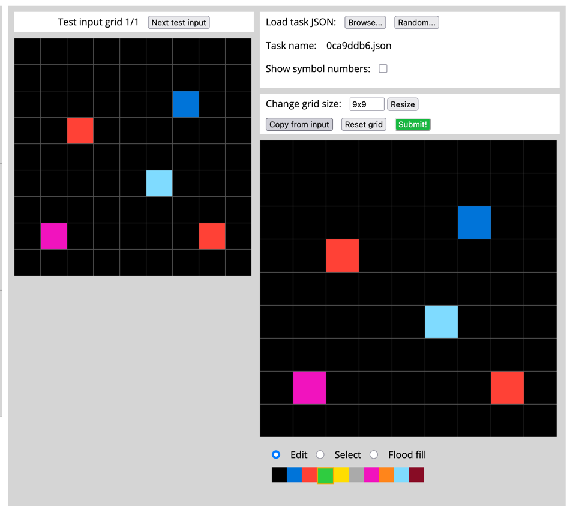
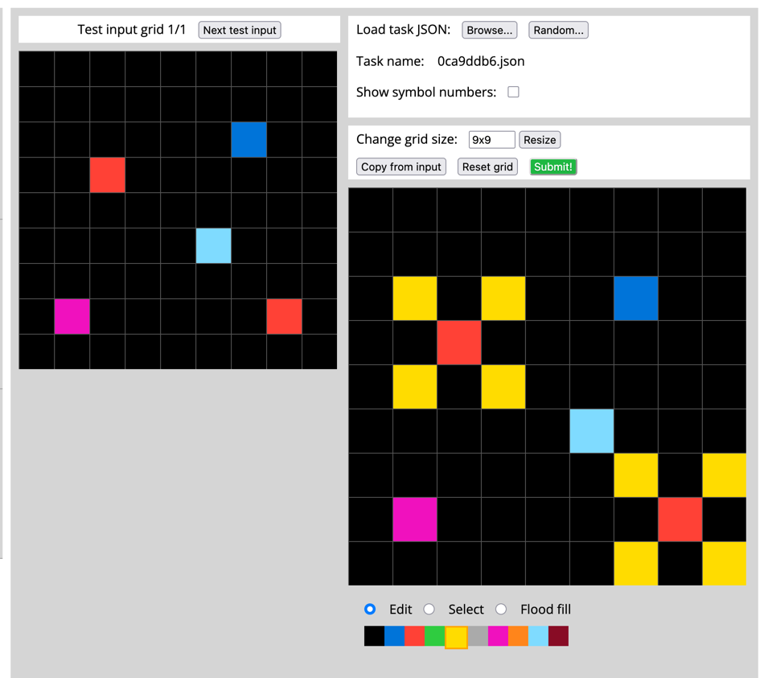
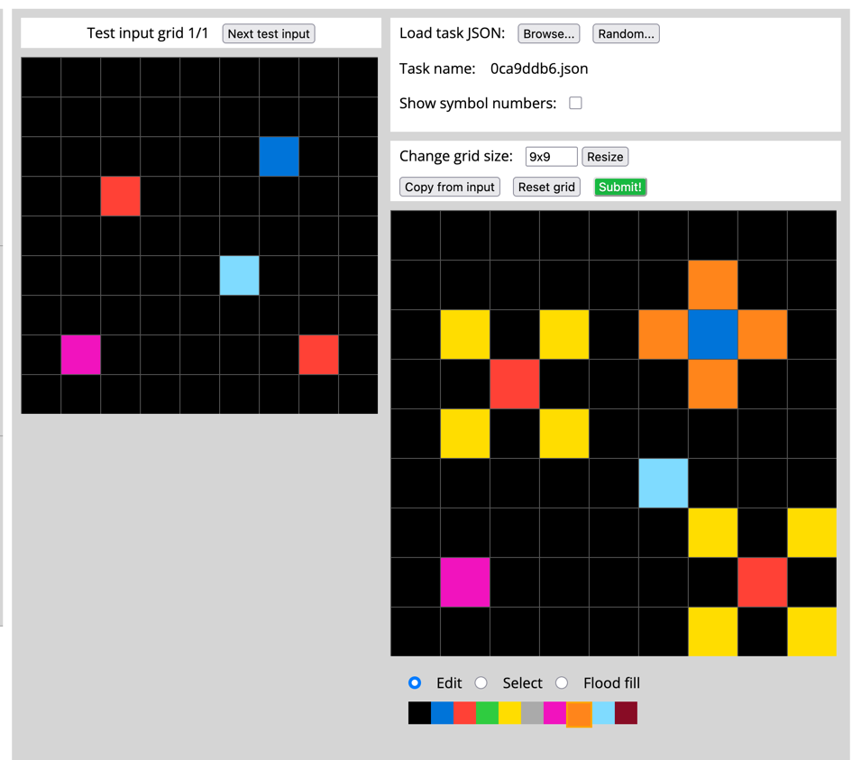

Let's take a look....

hmm... seeing some _growing_ going on here... looks like all the grids are
the same size before and after.

also looks like nothing is getting removed.

Yeah, okay so maybe the different colors are like seeds? And they grow in different patterns?

Let's check that.

<zoom 1>

So, looking at the start we have a red seed and a blue seed. Then, they grow.
The red gets some yellow petals, the blue gets orange ones.

Also, the red seeds petals grow diagonally, while the blue ones grow directly adjacent.

Okay let's look at the next one.

<zoom 2>

Okey dokey. Same pattern, but more seeds. 

WAIT. Not quite the same.

There's a light blue seed at position A1, and it does _not_ grow in the output. It just stays put.

Hmm okay. Any others like that in this example? No.

So some seeds do not grow. Specifically, light blue seeds.

Alright, next.

<zoom 3>

Okay, 3 seeds in, two flowers + 1 seed out. Hmm, this time the seed that did not grow was pink.

Looks like the only ones that grow are red and blue, seeds and they always grow the same way.

let's try solving this.

<zoom final>
First, let's copy the input.

<copy>

We've got two red seeds, 1 dark blue, 1 pink and 1 light blue. The pink and light blue don't grow, but
red and dark blue do. Let's fill in red first.

Looking good. Time to fill in dark blue. That has the orange on the top, left right and bottom.

This looks right, let's submit it!

<submit = correct>

Great! Way to go, me!