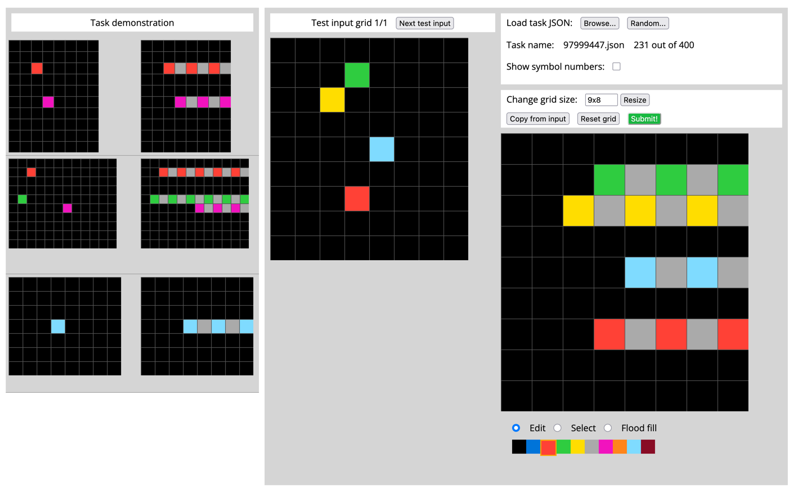

Looks like it's growing.

So, it always grows to the right.

In the third example, it grows 4 cells to a
total of 5, 3 blue and 2 gray.

The height doesn't change, but the width does.

Why the heck dos it grow so far in the middle one?

In the top, the shortest (pink) only grows 3 units.

In the middle, the shortest grows 4 units.

Maybe the right edge needs to be a color? I'm not sure that
even makes sense.

Oh shit! the dimensions of the array aren't changing! I see
the solution now.

Let's copy it over. <copy from input>

And we'll work from top to bottom.

Green needs to be: green - gray - green - gray - green

Yellow needs to be: 
    yellow - gray - yellow - gray - yellow - gray

light Blue needs to be:
    light blue - gray - light blue - gray

Then red:
    red - gray - red - gray - red

I think that's it. Let's try submitting this.

Sweet! It was correct.